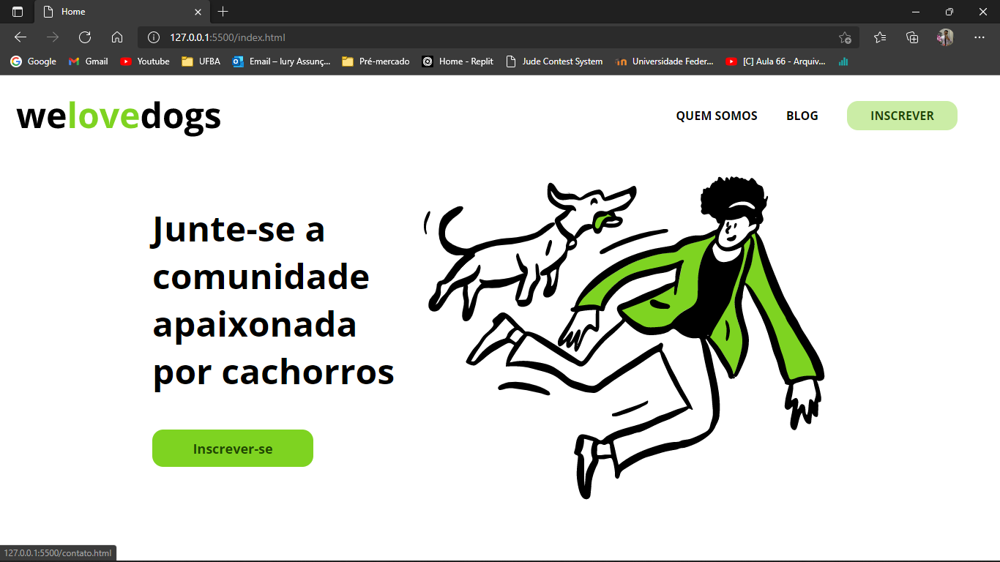
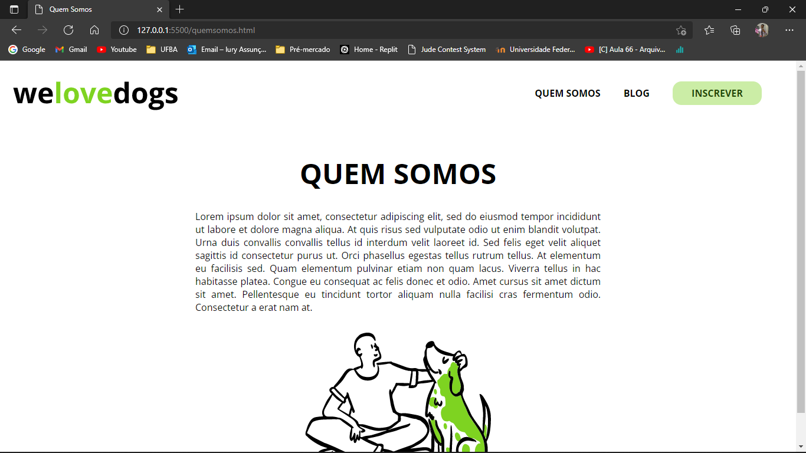
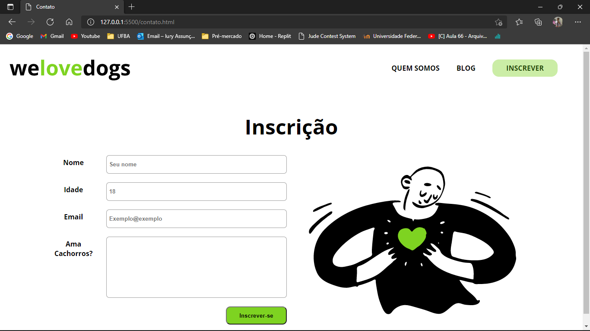

<div align="center"></div>

<hr>


<div style="display:flex">
    <div ></div>
    <div ></div>
</div>
<hr>
<div style="display:flex" >
    <div ></div>
    <div ></div>
</div>

<hr>
<br><br>
<h1>🔖 Sobre </h1>

<p>

O projeto WeLoveDogs tem por objetivo iniciar o aprendizado em HTML e CSS, 2 das 3 tecnnologias bases do front-end. O projeto possui o formato static multipage, com 4 páginas no total e a maneira de navegar e visualizar seu conteúdo por completo é através dos links do menu.</p>

<hr>
<br><br>
<h1>🗂 Como baixar e iniciar o projeto <h1>

```bash

# Clonando o repositório
$ git clone https://github.com/iury-assuncao/WeLoveDogs.git

# Acesse <WeLoveDogs/index.html>

```
